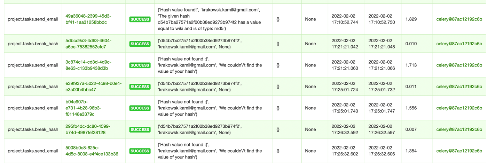

# Projekt z Zarządzania Infrastrukturą Telekomunikacyjną
 Temat 15. Opracowanie aplikacji z interfejsem webowym wspomagającej proces kryptoanalizy

## Lokalna instancja projektu

Backend:
```bash
docker-compose up --build
```
Frontend:
```bash
cd frontend && npm i && npm start
```

Konieczne jest także stworzenie pliku **.envs/.env** bazując na pliku **.envs/.env-example**

## Wykorzystane technologie i narzędzia

- Python 3.10
- FastAPI
- Docker && docker-compose
- Redis
- Celery
- Flower
- Postgresql
- JavaScript
- React

## Działanie aplikacji
Użytkownik podaje wiadomość zahaszowaną przy pomocy SHA256, SHA1 lub MD5 oraz swój adres e-mail
oraz wybiera jedną z 4 list ze słowami. Następnie aplikacja porównuje kolejne 
hasze pobierane z wybranej listy do hasza użytkownika. W przypadku odnalezienia zbieżności wysyła 
email z informacją o sukcesie i znalezionym słowie, a w przypadku wyczerpania listy słów lub przekroczenia 
limitu czasowego (10min) wysyła informację o braku sukcesu.

## Korzystanie z aplikacji

Wchodzimy na http://localhost:3000/ i wypełniamy formularz podając swoją zahaszowaną wiadomość,
adres e-mail oraz wybierając jedną z 4 list słów.


Np. słowo 'Pudzian', które znajduje się na jednej z list wyrazów, w MD5 to '3295b7283879090305aa229803b0d94b'.


Naciskamy przycisk 'Submit' orzymujemy wiadomość 
> > 'Your hash is being processed by our system. Await an email message with the results!'

i czekamy na wiadomość email. Po około 10-20 sekundach (w zależności od sprzętu oraz obłożenia systemu) otrzymujemy wiadomość:


W przypadku braku sukcesu otrzymalibyśmy taką wiadomość:


## Techniczny opis narzędzi
- Do obsługi kolejkowania zadań łamania haszy oraz wysyłania maili wykorzystałem kolejki Celery. 
Dzięki temu jednocześnie mogą wykonywać się maksymalnie 4 operacje, a pozostałe są dodawane do kolejki i wykonywane w odpowiedniej kolejnośći (FIFO)
- Do zapisywania danych i monitorowania kolejek i workerów Celery wykorzystałem Redis + Flower, który domyślnie można zobaczyć pod adresem http://localhost:5557/ i w którym możemy ustawić np Rate Limity czy Tiemouty naszych tasków 

- Konteneryzacja z wykorzystaniem Docker & docker-compose pozwala na bardzo proste uruchomienie projektu na prawie każdym sprzęcie z wykorzystaniem jednej komendy.